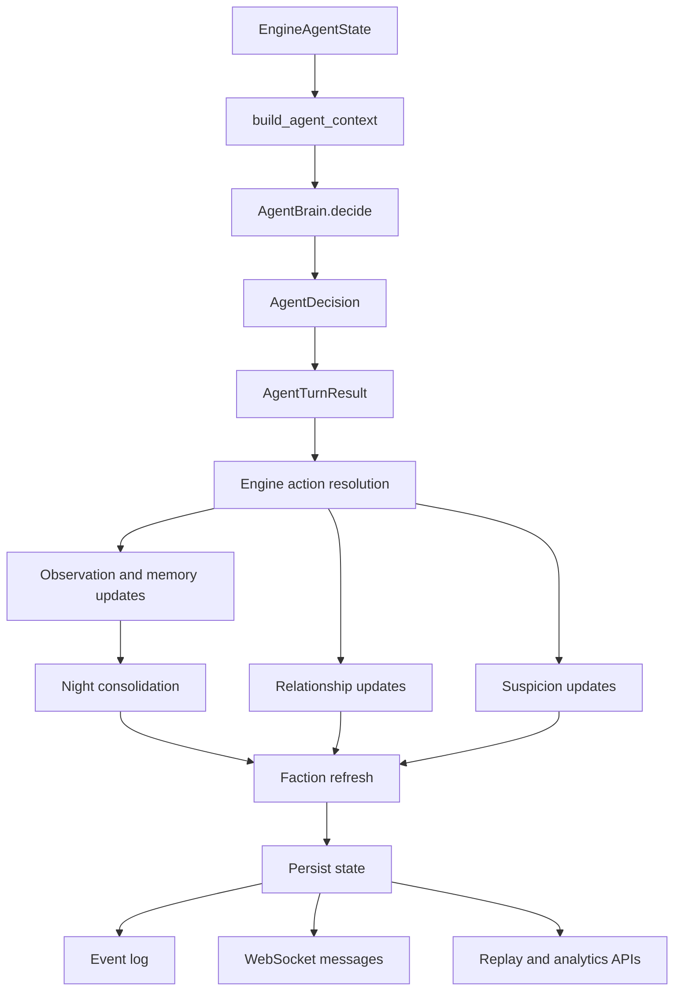
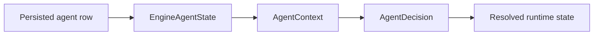
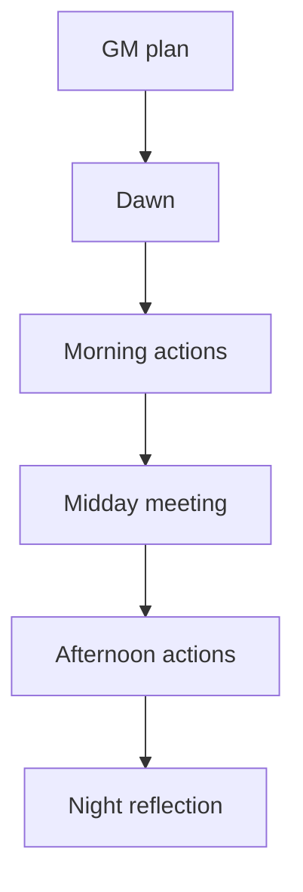

# Agent Runtime

This document explains what an agent is at runtime, how agent state changes during a round, and where those changes come from.

It is intended for:

- backend work on agent behavior
- frontend work on dossiers, live views, and replay screens
- debugging “why did this agent do that?”

## Why This Exists

The agent system is not just one LLM call. Runtime behavior is produced by a mix of:

- persisted agent state
- round context assembly
- structured LLM output
- deterministic simulation rules
- social side effects from conversations and meetings
- faction and exile updates

Without a reference doc, it is easy to confuse:

- what the model decided
- what the engine changed afterward
- what was persisted
- what was emitted to the UI

## High-Level Flow

## Runtime Objects

## `EngineAgentState`

This is the backend's main source of truth for an agent during simulation.

It contains:

- `agent_id`
- `name`
- `character_id`
- `status`
- `personality`
- `goal`
- `memory`
- `location`
- `inventory`
- `relationships`
- `suspicion_level`
- `llm_model`
- `faction_id`
- `faction_role`
- `influence`

Think of this as the full mutable runtime record used by the engine.

## `AgentContext`

This is the per-turn input assembled for the decision layer.

It combines:

- current `EngineAgentState`
- experiment id
- world state
- current crisis
- recent observations

This is what the LLM-facing decision code sees.

## `AgentDecision`

This is the structured model output from the agent LLM layer.

It contains:

- `inner_thought`
- `suspicion`
- `action`
- `dialogue`
- `goal_progress`
- `cooperation_intent`

Important: this is not the final resolved outcome. It is the intended decision before engine-side consequences are applied.

## `AgentTurnResult`

This wraps the decision and the immediate post-decision agent adjustments.

It contains:

- `decision`
- `updated_memory`
- `suspicion_level`
- `prompt`

This is the bridge object between the agent decision layer and the simulation engine.

## State Layers

The agent system has four practical layers:

### Persisted agent row

Stored in the database. Used to reconstruct simulation state between requests and rounds.

### `EngineAgentState`

Live runtime state used by the engine.

### `AgentContext`

Read-only turn input assembled for the agent brain.

### Resolved runtime state

The post-resolution result after conversations, meetings, faction refreshes, exile, and world effects have all been applied.

## What Changes During a Round

## 1. Context build

Before an agent decides, the engine builds a context that includes:

- current threat
- current resources
- current crisis
- observation list
- memory contents
- relationship memory

This happens in the engine before each action selection.

## 2. LLM decision

The agent brain prompts the model to return structured decision JSON.

The model chooses:

- what action to attempt
- whether the action is cooperative or selfish
- what suspicion thought to surface
- what progress story to tell about its goal

## 3. Immediate post-decision updates

After the decision returns, the backend applies some direct updates immediately:

- appends recent memory about the decision
- may add a key memory if the choice is strongly selfish
- may increase suspicion if the agent explored the perimeter fence
- may increase suspicion if the decision itself contains paranoia or meta suspicion
- may update location to the chosen action location

These updates happen before broader world resolution.

Important distinction:

- these direct updates are deterministic and happen inside `AgentBrain.decide`
- LLM-based memory classification and consolidation happen later through `AgentService.register_observation()` and the night phase

## 4. Action resolution

The engine then resolves actions across agents.

This can change:

- resources
- occupancy
- conflict outcomes
- whether the agent “wins” or “loses” a contested action

Important: the agent may intend one thing, but the resolved outcome can still change the narrative consequences.

## 5. Social side effects

When agents converse or participate in meetings, additional state changes occur:

- new memory entries are created for both sides of a conversation
- relationship trust changes for both sides of a conversation
- faction alignment may shift
- exile pressure may emerge

This is where many “why are these two suddenly allied?” questions are answered.

## 6. Faction refresh

After meaningful social changes, factions are recalculated from current runtime state.

This can change:

- `faction_id`
- `faction_role`
- `influence`

These changes are derived, not hand-authored by the model.

## 7. Exile

If a meeting escalates into exile:

- the target agent status becomes `exiled`
- the agent is removed from active participation
- faction state is refreshed again
- exile history is appended at the experiment level

This is one of the strongest non-LLM state transitions in the system.

## 8. Night reflection

At night, agents receive reflective memory updates based on:

- suspicion level
- cooperation ratio
- overall emotional state of the round

This is now the main consolidation pass for long-lived memory.

Per active agent, the backend:

- creates a reflective observation
- records it in `recent_events`
- may classify and promote it into `key_memories`
- may consolidate enough unconsolidated recent events into one higher-level key memory
- may consolidate relationship history into stable relationship notes

The night pass runs asynchronously across active agents before the round is persisted.

## Mutation Map

This section answers: “what code path mutates what field?”

| Field | Main mutation source |
|------|-----------------------|
| `memory.recent_events` | decision recording, observations, conversations, night reflection |
| `memory.key_memories` | selfish decisions, important observations, and night-time consolidation |
| `memory.last_consolidated_round` | night-time memory consolidation |
| `relationships` | conversation trust deltas, meeting vote deltas, relationship consolidation |
| `suspicion_level` | edge-of-map exploration, suspicious thoughts, failed or pressured social outcomes |
| `location` | chosen action location, exile relocation |
| `status` | runtime transitions like exile |
| `faction_id` / `faction_role` | faction refresh after social changes |
| `influence` | recalculated from agent traits and tension state |

## LLM vs Deterministic Logic

One of the most important distinctions:

## LLM-driven

These primarily come from model output:

- chosen action
- inner thought
- self-reported suspicion text
- cooperation intent
- goal progress text
- observation promotion into key memory
- key-memory consolidation summaries
- relationship-note consolidation

## Deterministic backend-driven

These are primarily engine-derived:

- resource outcome
- conflict winner/loser
- trust deltas
- faction membership
- cult detection
- exile targeting and enactment
- replay and analytics summaries

This split matters for debugging. If an agent joined a cult, that was not because the model literally returned “join cult”; it was because the backend interpreted the current social graph that way.

## Round Lifecycle by Phase

## Dawn

Effects on agents:

- indirect pressure only
- updated world state and crisis context

## Morning

Effects on agents:

- repeated decision cycles
- movement
- first major memory and suspicion updates
- possible conversation outcomes

## Midday

Effects on agents:

- meeting speeches and votes
- relationship shifts
- faction pressure
- possible exile

## Afternoon

Effects on agents:

- one committed action
- conflict resolution
- additional location/resource consequences

## Night

Effects on agents:

- reflective memory update
- emotional tone settles into memory

## Persisted vs Ephemeral Data

## Persisted

These survive across requests and rounds:

- identity and personality
- goal
- memory
- relationships
- suspicion level
- location
- inventory
- faction affiliation
- faction role
- influence
- exiled status

## Ephemeral or derived

These are rebuilt or recomputed:

- per-turn context
- observations passed into the brain
- current action attempt
- current round conversation grouping
- current faction graph instance

## Event and API Outputs

Agent runtime is exposed to the app through three main channels.

## Experiment detail

Use `GET /experiments/{id}` and dossier-related endpoints to read current agent state.

Useful fields for the frontend:

- status
- location
- suspicion level
- relationships
- faction membership
- influence

## WebSocket events

Use round and social events to animate or narrate runtime changes.

Relevant event families:

- `agent_action`
- `agent_move`
- `agent_speak`
- `meeting_speech`
- `meeting_vote`
- `faction_update`
- `cult_activity`
- `exile_vote`
- `exile_enacted`

## Replay and analytics

Use replay and analytics endpoints to reconstruct why runtime state ended up where it did.

Best sources:

- relationship analytics
- faction analytics
- highlights
- round snapshots

## Debugging Guide

When an agent behaves unexpectedly, inspect in this order:

## “Why did the agent choose this action?”

Check:

- prompt trace API
- `AgentDecision`
- current crisis and observations
- recent memory and key memories
- whether memory consolidation already summarized the pattern into a key memory

## “Why did the agent distrust someone?”

Check:

- relationship history
- consolidated relationship notes
- recent conversation content
- meeting vote deltas
- suspicion level and paranoia-heavy goals

## “Why did the agent join a faction or cult?”

Check:

- current trust graph
- goal archetype
- influence score
- faction analytics

## “Why is the agent no longer acting?”

Check:

- `status`
- exile history
- latest meeting outcome

## Frontend Use Recommendations

The app should treat runtime agent state as layered:

- current snapshot for truth
- websocket events for motion and drama
- replay/analytics for explanation

That means:

- dossiers should read directly from current agent state
- live overlays should react to websocket deltas
- report screens should use replay and analytics, not only raw current state

## Current Limits

This runtime model is still intentionally simplified.

Not fully modeled yet:

- explicit emotional state objects
- long-term personality drift
- faction-specific prompt injection
- romance-specific or sexuality-specific relationship dimensions
- agents intentionally reasoning about faction strategy as a first-class concept

Those can be added later, but this document describes the current operational model accurately enough to build against and debug from.
