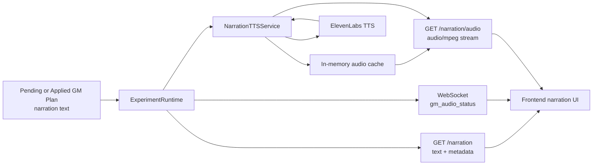

# Audio Narration

This document is the source of truth for backend-generated narration audio: how narration text
turns into playable audio, why the transport works the way it does, which parts are cached or
persisted, and how to verify the feature locally.

## Scope

The current implementation covers:

- server-side text-to-speech generation with ElevenLabs
- narration metadata and audio delivery for a specific experiment round
- lightweight websocket readiness updates for the frontend
- in-memory caching of generated audio per backend process

The current implementation does not cover:

- frontend playback UX
- persisted audio blobs or object storage
- per-user voice preferences
- incremental text-to-speech from token-streamed LLM output

## High-Level Design

Narration audio is derived from GM narration text that already exists in the runtime. The backend is
the only caller of ElevenLabs. The frontend never sees ElevenLabs credentials.

Transport choices:

- narration text and audio metadata are served over REST
- audio bytes are streamed over REST from the backend
- websocket messages only carry readiness state via `gm_audio_status`

This split is intentional:

- the full narration text is already known before audio generation starts
- the existing experiment websocket path is JSON-only and not a good place to push binary media
- HTTP streaming is simpler for browser audio playback, retries, and cache behavior



## Runtime Flow

1. A pending GM plan is generated or revised, or an approved plan is applied.
2. If the plan includes narration text, `ExperimentRuntime` builds a
   `NarrationAudioRequest`.
3. The runtime immediately broadcasts `gm_audio_status` with `pending` or `ready`.
4. A background prewarm task asks `NarrationTTSService` to fetch and cache the audio.
5. The frontend can call:
   - `GET /api/experiments/{experiment_id}/rounds/{round_number}/narration`
   - `GET /api/experiments/{experiment_id}/rounds/{round_number}/narration/audio?v=<narration_id>`
6. If the audio is cached, the backend streams cached bytes. Otherwise it proxies the ElevenLabs
   stream, yields chunks to the client, and stores the completed audio in memory.

Narration text resolution order:

1. current pending or applied GM plan for that round
2. persisted `round_end` summary GM narration from the event log

That allows audio playback for both in-progress and already-completed rounds.

## Backend Components

### `backend/app/tts/service.py`

`NarrationTTSService` owns app-level behavior:

- build stable audio requests
- expose a public-safe `narration_id` derived from the resolved audio inputs
- select the voice for the current map
- compute cache keys
- manage inflight generation and cache population
- expose cache/readiness state to the runtime

### `backend/app/tts/elevenlabs.py`

`ElevenLabsNarrationProvider` owns provider-facing behavior:

- construct the ElevenLabs SDK client
- translate our request model into provider SDK calls
- map provider exceptions into HTTP-facing `NarrationAudioError`
- close owned network resources on shutdown

### `backend/app/api/runtime.py`

`ExperimentRuntime` integrates audio into the round lifecycle:

- prepares narration audio once a GM plan draft exists
- emits `gm_audio_status`
- serves narration metadata and audio streams through route handlers

### `backend/app/api/routes/narration.py`

Dedicated experiment-scoped routes expose the feature:

- `GET /api/experiments/{experiment_id}/rounds/{round_number}/narration`
- `GET /api/experiments/{experiment_id}/rounds/{round_number}/narration/audio?v=<narration_id>`

## Cache And Persistence

Audio bytes are not stored in Postgres.

Cache behavior:

- cache is in-process only
- cache uses a TTL/LRU policy
- `narration_id` is the public version identifier and is derived from the same inputs as the cache key
- the underlying cache key includes:
  - experiment id
  - round number
  - narration text
  - selected voice id
  - model id
  - output format
  - voice tuning settings

Implications:

- repeated requests for the same narration on the same backend process are fast
- a backend restart drops cached audio
- replay remains possible because narration text is persisted, even though audio is not
- changing narration text, narrator voice, model, output format, or voice settings changes the
  `narration_id` and therefore changes the browser-visible audio URL too

## Voice Selection

The backend currently supports one default narrator voice plus map-specific overrides.

Configuration model:

- `ELEVENLABS_VOICE_ID` is the default voice
- `MAP_NARRATOR_VOICE_IDS` in `backend/app/core/config.py` can override that per map

Current behavior:

- maps fall back to `ELEVENLABS_VOICE_ID` unless a map-specific voice id is set in code

## ElevenLabs Configuration

Required to enable audio narration:

- `ELEVENLABS_API_KEY`
- `ELEVENLABS_VOICE_ID`
- `ELEVENLABS_MODEL_ID`

Current defaults:

- `ELEVENLABS_OUTPUT_FORMAT=mp3_44100_128`
- `ELEVENLABS_TIMEOUT_SECONDS=8`
- `ELEVENLABS_STABILITY=0.6`
- `ELEVENLABS_SIMILARITY_BOOST=0.75`
- `ELEVENLABS_STYLE=0.0`
- `ELEVENLABS_SPEED=0.95`

The sample env file intentionally does not include a fake voice id. Choose a real voice from your
ElevenLabs account.

## TLS And Trust Store Behavior

The ElevenLabs provider uses the OS trust store via `truststore` when it builds its owned
`httpx.AsyncClient`.

Why this matters:

- `curl` and the host OS may trust a certificate chain that Python's default CA bundle rejects
- using the OS trust store avoids machine-specific certificate workarounds in app setup
- this is the production behavior, not a local-only bypass

The backend does not disable TLS verification.

## Websocket Contract

`gm_audio_status` is additive to the existing GM and round messages.

Payload shape:

- `pending`: `{ "status": "pending", "narration_id": "<id>" }`
- `ready`: `{ "status": "ready", "narration_id": "<id>", "audio_url": "..." }`
- `error`: `{ "status": "error", "narration_id": "<id>", "error": "..." }`

The websocket never carries audio bytes.

Metadata contract:

- `GET /narration` always returns the exact resolved narration text for the round
- when TTS is configured, metadata also returns `narration_id` and a versioned `audio_url`
- when TTS is unavailable, metadata still returns the text with `status: unavailable` so the
  frontend can render text-only fallback without a second source of truth

Audio cache semantics:

- versioned `GET /narration/audio?v=<narration_id>` responses are safe to cache with
  `Cache-Control: public, max-age=31536000, immutable`
- unversioned `GET /narration/audio` responses return `Cache-Control: no-store`
- a stale `v` value is rejected with `409` because the route only serves the currently resolved
  narration for that round

## Error Mapping

The narration routes currently map failures like this:

- `404`: experiment or round not found
- `409`: narration text is not available for that round yet
- `503`: ElevenLabs is not configured or the provider is rate limited
- `504`: provider timeout
- `502`: provider auth/config/request failure or other upstream error

## Local Verification

1. Set `ELEVENLABS_API_KEY`, `ELEVENLABS_VOICE_ID`, and `ELEVENLABS_MODEL_ID` in `backend/.env`.
2. Run the backend in smoke mode:

```bash
cd backend
make migrate
BACKEND_RUNTIME_MODE=smoke_mock make backend-run
```

3. Create an experiment and generate or revise the next GM plan.
4. Fetch narration metadata:

```bash
curl -s "http://127.0.0.1:8000/api/experiments/$EXP_ID/rounds/1/narration" | jq
```

5. Fetch and play the audio:

```bash
NARRATION_URL="$(curl -s "http://127.0.0.1:8000/api/experiments/$EXP_ID/rounds/1/narration" | jq -r '.audio_url')"
curl -sS -D - \
  "http://127.0.0.1:8000${NARRATION_URL}" \
  -o /tmp/narration.mp3
file /tmp/narration.mp3
afplay /tmp/narration.mp3
```

If `file` reports JSON instead of MPEG audio, the backend returned an error payload instead of an
MP3 stream.

## Agent Speech Audio

In addition to GM narration, the backend generates per-agent TTS audio for dialogue spoken during
the simulation. Each of the 22 character sprites has a unique ElevenLabs voice.

### Voice Mapping

`CHARACTER_VOICE_IDS` in `backend/app/core/config.py` maps character ID to ElevenLabs voice ID.
Unmapped characters fall back to `ELEVENLABS_VOICE_ID`.

`NarrationTTSService.voice_id_for_character(character_id)` resolves the voice for a given character.

### Pregeneration

When agent decisions are resolved for a round, the runtime pregenerates TTS audio for all agent
dialogue in parallel via `asyncio.gather()`. This happens before the frontend enters the talking
phase, so audio is typically ready when the speech bubble appears.

### Transport

Agent speech audio uses the same split transport as GM narration:

- `agent_speech_audio` WebSocket message carries readiness status per utterance
- `GET /api/experiments/{id}/agents/{agent_id}/speech` returns metadata
- `GET /api/experiments/{id}/agents/{agent_id}/speech/audio?round=N&index=I` streams MP3 audio

The `round` and `index` parameters identify which utterance (an agent may speak multiple times per
round).

### Frontend Playback

`ConversationBubble.vue` plays audio when the bubble appears:

- If audio is `ready` on mount: plays immediately
- If audio is `pending`: waits up to 3s, then falls back to text-only (6s auto-dismiss)
- If audio is `unavailable` or `error`: text-only behavior
- Turn pacing waits for audio completion before advancing (max 15s timeout)
- A mute toggle in the HUD control bar persists via localStorage

### Cache

Agent speech audio uses the same in-memory LRU/TTL cache as GM narration. Cache keys include the
text, voice ID, model ID, and voice settings, so identical utterances with the same voice hit cache.

## Code References

- `backend/app/api/routes/narration.py`
- `backend/app/api/runtime.py`
- `backend/app/tts/service.py`
- `backend/app/tts/elevenlabs.py`
- `backend/app/core/config.py` — `CHARACTER_VOICE_IDS`
- `backend/tests/test_tts_service.py`
- `backend/tests/test_agent_speech.py`
- `frontend/src/components/social/ConversationBubble.vue`
- `frontend/src/stores/social.ts`
- `frontend/src/stores/turn.ts`
- `frontend/src/config/audio.ts`
