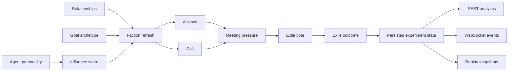
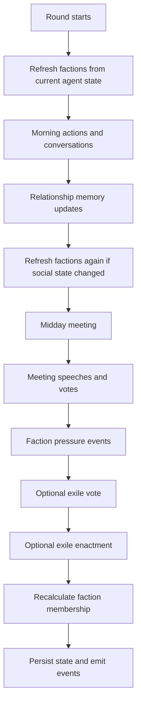

# Factions, Cults, and Exile

This document explains how the backend models faction formation, cult behavior, and exile, and how the app should consume those systems.

## Why This Exists

These mechanics sit across multiple layers:

- simulation state
- meeting resolution
- event logging
- websocket updates
- replay and analytics APIs

Without a shared reference, it is easy for the frontend to infer the wrong behavior or for future backend changes to break the intended social loop.

## Concept Model

At a high level, the social loop now works like this:

## Core Concepts

### Faction

A faction is a derived social group built from the current runtime state. It is not manually configured.

Faction fields:

- `faction_id`: stable runtime identifier
- `name`: display label for the UI
- `kind`: `alliance` or `cult`
- `leader_id`: agent currently steering the faction
- `member_ids`: all included agents
- `doctrine`: optional belief statement, mainly for cults
- `influence`: aggregate social weight of the group
- `formed_round`: round in which the current faction instance was derived
- `pressure`: how strongly the faction is distorting the social environment

### Alliance

An alliance is the default faction type.

Alliances form when:

- agents have positive trust edges
- agents share compatible goals
- the connected component is large enough to matter

Alliances are intended to communicate coordination, blocs, and voting behavior.

### Cult

A cult is a specialized faction with stronger ideological pressure.

Cults form when:

- a leader is belief-oriented or marked by devout traits
- nearby agents are sufficiently aligned, trusting, or susceptible

Cults differ from alliances in two ways:

- they carry `doctrine`
- they emit `cult_activity` instead of a generic faction update

In the UI, a cult should feel more dangerous and narratively charged than a normal alliance.

### Exile

Exile is the strongest social sanction in the current sim.

Exile happens when:

- meeting conditions are tense enough to justify scapegoating
- the social service selects a target based on suspicion and faction context
- the vote crosses the banishment threshold

When exile is enacted:

- the target agent status becomes `exiled`
- the target is moved out of normal active participation
- the outcome is appended to experiment `exile_history`
- follow-on faction state is recalculated

## Round Flow

The backend currently refreshes and applies these mechanics in this order:

## Backend Rules

### Influence

Each agent has a derived `influence` score. It is used to choose leaders and to estimate faction weight.

Influence is based on a blend of:

- dominance
- loyalty
- ambition
- suspicion

This is not a moral score. High suspicion can make an agent more destabilizing and therefore more influential in a bad way.

### Faction Refresh

Factions are not permanent rows with their own lifecycle engine yet. They are refreshed from the live graph.

Refresh currently happens:

- at round start
- after conversation outcomes meaningfully shift relationship memory
- after meeting relationship deltas are applied
- after exile changes the active population

### Cult Selection

Cults are detected before normal alliances. This matters because cult candidates should not get flattened into a generic alliance if the backend can identify a stronger ideological grouping.

### Exile Targeting

The exile system is suspicion-driven first, then socially contextual.

Current target selection priorities:

- very high suspicion
- cult or faction leadership under high suspicion
- no target if tension has not concentrated enough on one agent

### Exile Voting

Votes are derived from:

- whether the voter is the target
- shared faction membership
- paranoia level
- overall threat level
- target suspicion

This produces three possible outcomes:

- `banish`
- `protect`
- `abstain`

## Persisted Runtime State

The following experiment fields are now persisted:

- `factions`
- `exile_history`

The following agent fields are now persisted:

- `faction_id`
- `faction_role`
- `influence`

This means the frontend does not need to reconstruct these concepts from logs.

## API Surface

### Included on experiment detail

`GET /experiments/{id}` returns:

- `factions`
- `exile_history`

This should be the frontend's source of truth for current social grouping state.

### Analytics endpoints

Use these for dashboards, overlays, and reports:

- `GET /experiments/{id}/analytics/summary`
- `GET /experiments/{id}/analytics/relationships`
- `GET /experiments/{id}/analytics/factions`
- `GET /experiments/{id}/analytics/highlights`

Recommended usage:

- summary cards and current experiment KPIs: `analytics/summary`
- trust graph, betrayal graph, social network: `analytics/relationships`
- faction sidebar, cult badge list, membership panels: `analytics/factions`
- “important moments” feed or report reel: `analytics/highlights`

### Replay endpoints

Use these for round-by-round navigation:

- `GET /experiments/{id}/replay`
- `GET /experiments/{id}/rounds/{round_number}/snapshot`

Recommended usage:

- timeline scrubber and round index: `replay`
- detailed replay panel for a selected round: `rounds/{n}/snapshot`

## WebSocket Events

The frontend should listen for these event types during live simulation:

- `faction_update`
- `cult_activity`
- `exile_vote`
- `exile_result`

Suggested handling:

- `faction_update`: refresh faction badges, map overlays, or agent group chips
- `cult_activity`: show stronger warning styling, narration accents, or doctrine UI
- `exile_vote`: open or update a meeting-side vote panel
- `exile_result`: mark the agent as exiled and remove them from active social views

## Frontend Integration Notes

### Agent dossier

Show directly from agent state:

- current faction
- faction role
- influence
- exiled status

### Social / meeting view

Use current faction data to:

- cluster agents visually
- annotate speeches with faction membership
- distinguish cult rhetoric from normal bloc politics

### Replay / report view

Use replay and highlight APIs to make faction shifts legible:

- when a bloc first appears
- when a cult starts dominating discussion
- when exile changes the power balance

## Example Scenarios

### Alliance scenario

1. Two agents repeatedly gain trust through conversations.
2. Their goal archetypes align.
3. Faction refresh groups them into an alliance.
4. In the meeting they tend to support the same proposal.
5. Analytics now exposes the bloc and the relationship edge.

### Cult and exile scenario

1. A belief-oriented agent accumulates influence and suspicion.
2. A cult forms around that agent with doctrine and pressure.
3. The meeting becomes polarized around that group's rhetoric.
4. Suspicion concentrates on the cult leader.
5. An exile vote is triggered.
6. If the banishment threshold is met, the leader is exiled.
7. The experiment state, logs, websocket stream, and replay surfaces all reflect the change.

## Current Limits

This system is intentionally lightweight for now.

Not implemented yet:

- permanent faction identity across major membership changes
- faction-specific strategy prompts
- explicit recruitment actions
- faction inventories or territory control
- reversible exile or jailbreak mechanics

Those can be added later without changing the basic app contract described here.
