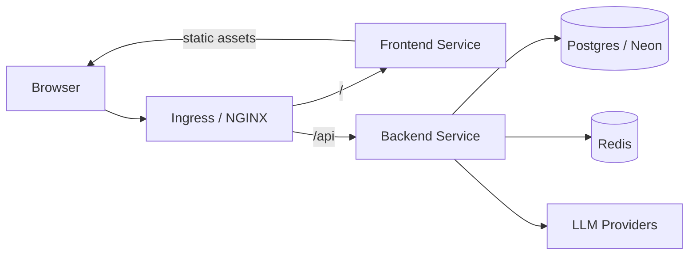
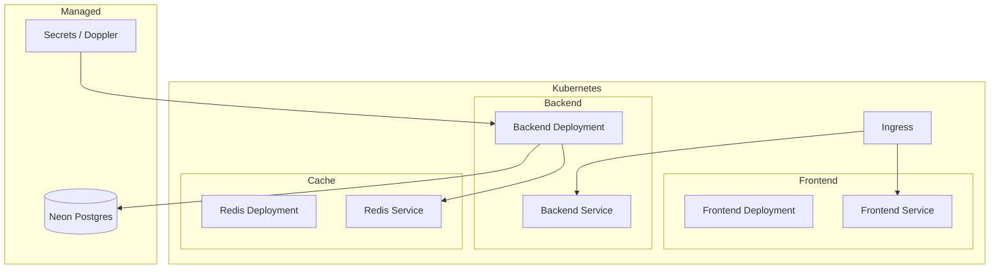
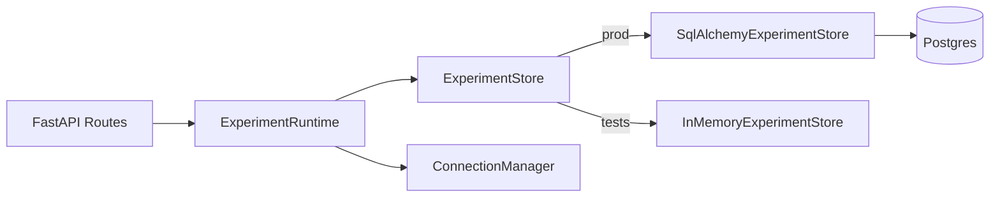
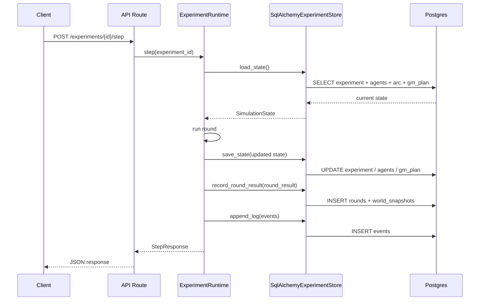
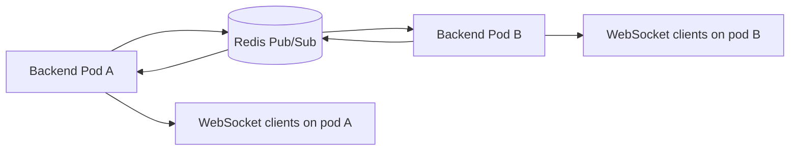

# Infrastructure And Runtime Persistence

This document describes how `the-experiment` is wired today after the runtime-persistence work landed.

It is meant to answer four reviewer questions:

1. What runs where?
2. How does traffic move through the system?
3. What is durable versus in-memory?
4. What still needs follow-up work?

## System Overview

## Deployment Topology

## Request Routing

The intended routing contract is:

| Path | Destination | Purpose |
|------|-------------|---------|
| `/` | frontend | Vue application |
| `/api/*` | backend | REST + WebSocket upgrade path |

The important constraint is that the frontend and production ingress use the same API prefix. That removes environment-specific path rewriting from the application contract.

## Runtime Architecture

Before this PR, experiment state lived entirely in the Python process. A backend restart lost:

- experiment metadata
- agent state
- GM plans
- unresolved plotlines
- recent events
- event log

After this PR, the runtime is split into two layers:

## What Is Durable

These parts of `SimulationState` are now persisted in Postgres:

| Area | Persistence strategy |
|------|----------------------|
| Experiment metadata | `experiments` row |
| Current world state | JSON snapshot on `experiments.world_state` |
| Resources and threat | top-level experiment fields plus world-state snapshot |
| Auto-approve flag | `experiments.auto_approve` |
| Unresolved plotlines | JSON field on `experiments` |
| Recent events summary | JSON field on `experiments` |
| Agents | `agents` rows |
| Agent goal payload | JSON field on `agents.goal` |
| Agent memory | JSON field on `agents.memory` |
| GM plan for the current round | `gm_plans` row with status and timestamps |
| Event log items | `events.payload` |
| World snapshot per round | `world_snapshots.state` |
| Round record | `rounds` row |

## What Is Still In-Memory

These parts still live in process memory by design:

| Area | Why |
|------|-----|
| Active WebSocket connections | socket handles are process-local |
| Broadcast fanout | no Redis pub/sub fanout yet |
| Test runtime store | faster and simpler for API tests |

This means:

- a backend restart should preserve simulation state
- a backend restart will still drop active websocket subscribers
- horizontal scaling is still incomplete until broadcast fanout is externalized

## Persistence Flow

## Schema Additions In This PR

The new migration extends the existing schema to support reconstructing `SimulationState` faithfully enough for restart recovery.

Added fields:

- `experiments.auto_approve`
- `experiments.world_state`
- `experiments.unresolved_plotlines`
- `experiments.recent_events`
- `agents.character_id`
- `agents.goal`
- `gm_plans.status`
- `gm_plans.approved_at`
- `gm_plans.applied_at`

## Why Redis Is Not In The Critical Path Yet

Redis is still provisioned as infrastructure, but it is not the source of truth for simulation state.

That is deliberate:

- Postgres should own durability
- Redis should only own ephemeral coordination
- mixing durable state across both systems this early would make failure behavior harder to reason about

The next reasonable Redis usage is WebSocket fanout:

## Operational Implications

### What Gets Better With This PR

- backend restarts no longer imply total experiment loss
- API read paths can reconstruct experiment state from Postgres
- logs and round snapshots become inspectable outside process memory
- the code now has an explicit store boundary, which makes further persistence work cheaper

### What Does Not Change Yet

- there is still no background worker model
- there is still no multi-pod real-time fanout
- tests do not yet exercise a live Postgres integration path
- Redis remains largely unused by the application layer

## Follow-Up Work

Recommended next steps:

1. Add an integration test suite that runs the SQLAlchemy store against a real Postgres instance.
2. Add startup migration execution in deployment.
3. Externalize WebSocket fanout via Redis pub/sub before enabling multiple backend replicas.
4. Decide whether event-log payloads should remain generic JSON or become more queryable tables.
5. Add operational runbooks for restore/recovery and migration rollback.

## Source Map

Primary code paths involved in this design:

- `backend/app/api/runtime.py`
- `backend/app/api/store.py`
- `backend/app/api/routes/experiments.py`
- `backend/app/db/models.py`
- `backend/alembic/versions/20260307_000003_add_runtime_persistence_fields.py`
- `chart/the-experiment/`
